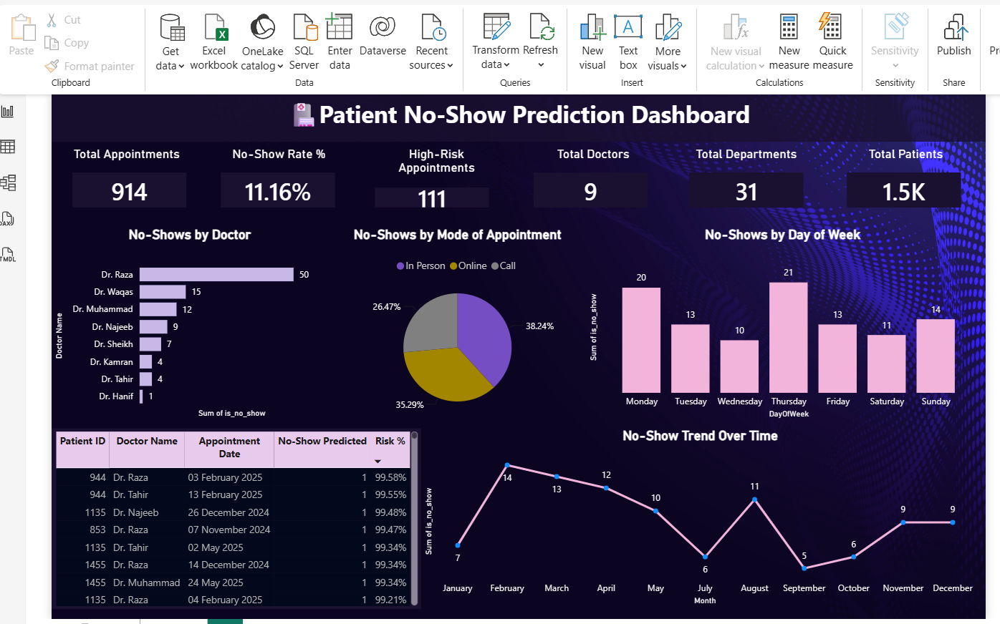

# 🏥 Healthcare Appointment No-Show Analysis

Predicting patient no-shows for hospital appointments using machine learning, and visualizing insights through an interactive Power BI dashboard.

## 📌 Overview
Hospitals lose significant time and revenue when patients miss scheduled appointments without notice. This project analyzes hospital management data to **predict which patients are likely to no-show**, so clinics can take proactive steps like reminder calls or overbooking strategies.

## 🔧 Approach
- Imported and merged multiple related hospital datasets (Appointments, Patients, Doctors, Departments) from Excel
- Engineered key features:
  - Patient **Age** (calculated from date of birth)
  - **Day of the week** of the appointment
  - Patient **Gender**
  - Each patient's **history of past no-shows**
- Built a **Logistic Regression** model to classify appointments as *Show* vs *No-Show*
- Generated no-show **probability scores** for every appointment

## 📊 Model Performance
| Metric | Score |
|---|---|
| Accuracy | **93.4%** |
| Recall (No-Show class) | 78% |
| Precision (No-Show class) | 72% |

## 📈 Dashboard
Built an interactive **Power BI dashboard** to explore no-show trends by doctor, department, day of week, and appointment mode (in-person vs online/call).

**Key insights from the dashboard:**
- Overall no-show rate: **11.16%**
- 914 total appointments analyzed across 31 departments
- 111 high-risk appointments flagged for follow-up

## 🛠️ Tools Used
- **Python** (pandas, scikit-learn) — data cleaning, feature engineering, model building
- **Power BI** — interactive dashboard and visualization

## 📁 Files
- `health_care.ipynb` — full Python analysis and model
- `dashboard.png` — Power BI dashboard preview
- `Health_care_prediction_dashboard...` — Power BI file
